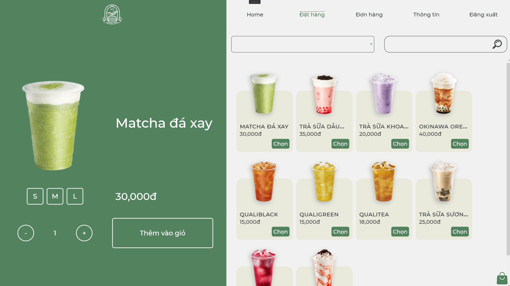
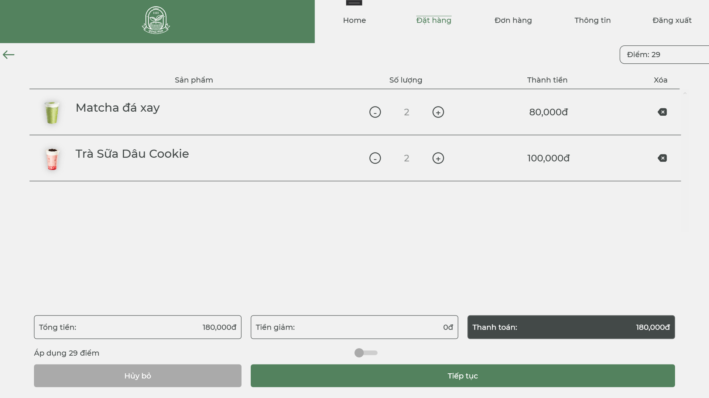

# WPF_Qualitea
This is a milk tea shop management app that supports the owners and staff in selling, managing inventory, revenue and customers. The app has 3 main parts: the part of the administrator (Admin), the part of the employee (Employee) and the part of the customer (Customer).

## Admin
The Admin part allows administrator to add, delete, edit product types, products, employees, view revenue, view statistics.
* ### Login

> The administrator needs to log in to access the system. The administrator will enter their login information and check the box below. Finally, they will click the login button to log in.
>
> 
* ### View orders and view statistics
> Administrator can view orders and statistics at different times.
> 
> 
>
> 
> 
* ### Category management
> View categories
> 
> 
> 
> Add new category
> 
> 
> 
> Edit category
> 
> 
>
* ### Product management
> View products
> 
> 
> 
> Add new product
> 
> 
> 
> Edit product
> 
> 
>
* ### Employee management
> View employees
> 
> 
> 
> Add new employee
> 
> 
> 
> Edit employee
> 
> 
>

## Employee
The employee part allows you to place orders for customers, review bills, receive online orders.
* ## Login
> The way employees login is similar to that of an administrator. Based on login information, employees will be assigned to the appropriate interface.
>
> 
* ### Home
> Employees can see the total number of orders and sales they sell for the day.
> 
> 
>
* ### Create new order
> The staff will select the products according to the customer's request to proceed to create the order.
>
> 
> 
> If the customer provides a customer code, the staff can enter it so that the customer can accumulate points or apply points to reduce the price if the customer requests it.
> 
> 
> 
* ### Check orders
> Staff can view the order and make the correct preparation according to the above products, once completed, the staff can click "finish" to confirm the completion of the order.
> 
> 
> 
> Staff can view online orders placed by customers by clicking the bell and can take that order.
> 
> 
> 

## Customer
* ### Register
> To log into the system, customers can register a new account by themselves.
>
> 
>
> 
* ### Login

> Customers will enter their login information and click the login button without having to check the box below.
>
> 

* ### Home
> Home interface, with the product the store wants to show.
> 
> 
>
* ### Order
> Select the product you want to order and add to cart.
> 
> 
> 
> 
> 
> Check cart
> 
> 
> Continue to enter delivery information and click confirm to order
> 
> 
> 
> After clicking "confirm", the order has been sent to the staff and the message "Order confirmation is successful. You will receive XXX points after the staff receive the order".
>
> 
> 
* ### Review your orders
> All orders from that customer will be displayed on the right. When selecting an order, its information will be displayed on the left. Customers can cancel the order if there is no staff to accept the order.
> 
> 
> 
> After the staff confirms the order, the order will be updated with the status and the customer can no longer cancel the order.
> 
> 
> 
* ### View customer information
> 
> 
